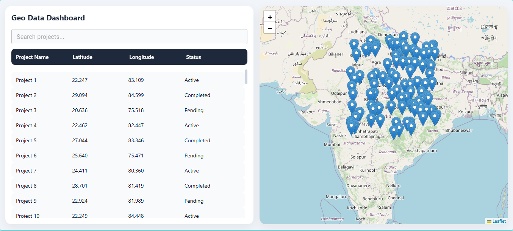
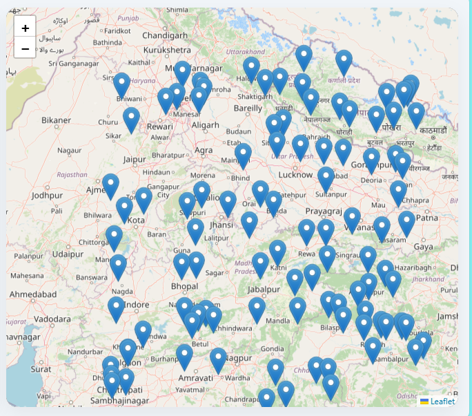
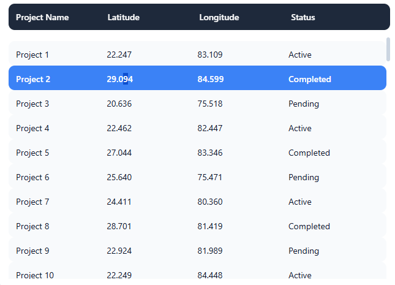
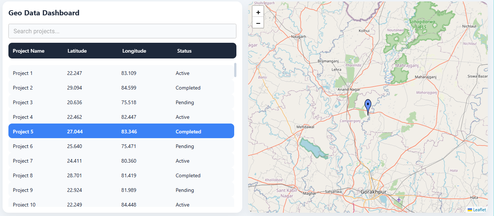

# Geo Data Dashboard

A React-based dashboard that visualizes spatial and tabular geo data with full synchronization between a virtualized table and an interactive map.

---

## 🚀 Live Demo

[https://geo-dashboard-gold.vercel.app/]

---

## 🛠 Tech Stack

- React (Vite)
- Functional Components + Hooks
- Material UI
- Leaflet (react-leaflet)
- @tanstack/react-virtual
- JavaScript (ES6+)

---

## 📂 Project Structure

src/
 |
 ├── api/            -> mock API layer  
 ├── components/     -> UI components  
 ├── hooks/          -> custom hooks  
 ├── utils/          -> helper utilities  
 ├── styles.css      -> global styling  
 ├── App.jsx  
 └── main.jsx  

Clear separation between:

- UI logic (components)
- Data logic (hooks)
- API simulation (api folder)

---

## ✨ Features Implemented

### Data Table
- Virtualized table supporting 5k+ rows
- Client-side filtering
- Smooth scrolling without performance lag
- Highlight row on selection

### Map Integration
- Interactive Leaflet map
- Markers plotted using latitude/longitude
- Marker highlighting when table row clicked
- Row highlighting when marker clicked
- Auto zoom to selected marker

### State Management
- Local React state only (no Redux)
- Shared `selectedId` for synchronization

### Performance
- Virtualization using @tanstack/react-virtual
- Only visible rows rendered to DOM
- Optimized re-renders

---

## 🧠 Key Design Decisions

### 1. Use of Virtualization

To meet the requirement:

> “The table should handle 5k+ rows without lag”

I used `@tanstack/react-virtual` instead of rendering normal HTML tables.

This ensures:

- Only ~10-15 rows are rendered at any time
- DOM size remains small
- Smooth scrolling even with 10k+ rows

### 2. Local State Instead of Redux

Requirement specified:

> “Local state only”

Therefore:

- `selectedId` is maintained in a custom hook
- Passed down via props
- Keeps architecture simple and predictable

### 3. Separation of Concerns

- MapView.jsx → only map UI logic  
- DataTable.jsx → only table UI logic  
- useGeoData.js → data fetching logic  
- mockApi.js → API simulation  

This ensures high code readability and maintainability.

### 4. Two-Way Synchronization

Implemented bidirectional sync:

- Click row → marker highlights + map zoom  
- Click marker → table row highlights + auto-scroll  

---

## 🧪 Handling Large Datasets

Even with 5000+ rows:

- No lag
- No browser freeze
- Constant memory usage

Reason:

- Table uses virtualization
- Only visible rows are rendered

You can test by increasing dataset size in:

src/api/mockApi.js

const DATA = generateMockData(10000);

---

## 🖥 How to Run Locally

npm install  
npm run dev  

Open: http://localhost:5173

---

## ⏱ Time Spent

| Task | Time |
|-----|-----|
| Project setup | 30 min |
| Mock API creation | 45 min |
| Table + virtualization | 1.5 hours |
| Map integration | 1 hour |
| Sync logic | 1 hour |
| UI styling | 1 hour |
| Documentation | 30 min |

**Total: ~6 hours**

---

## 📸 Screenshots

(Attach screenshots in GitHub README or /screenshots folder)

 ### Dashboard View

 ### Map View

 ### Charts Section

  ### Selected_Row
  

---

## 🔗 GitHub Link

[https://github.com/Prashant059/Geo-Dashboard]

---

## 📌 Evaluation Criteria Addressed

### Component Decomposition
- Clear modular components  
- Separation of logic and UI  

### Handling Large Datasets
- Virtualized table  
- Tested with 5k+ rows  

### Map + UI Synchronization
- Fully bidirectional interaction  

### Code Readability
- Clean folder structure  
- Meaningful naming  
- Functional components only  

---

## 📈 Possible Improvements

- Server-side pagination  
- Marker clustering  
- Sorting by columns  
- Dark mode  
- TypeScript migration  

---

### Author
[Prashant Randive]
